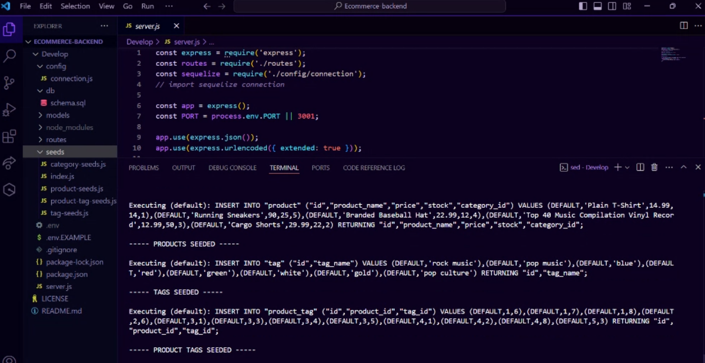
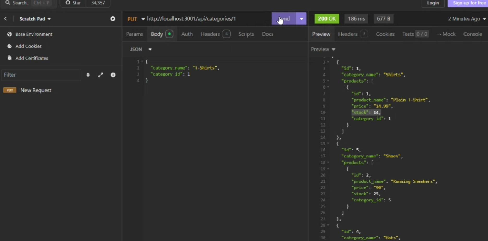

# E-commerce Back End

## Description
This project is the back end for an e-commerce site. It is built using Express.js and Sequelize to interact with PostgreSQL. The back end uses Rest commands to post, delete, and put new data into each section. The sections are categories, tags, and products. 

## Installation
- Clone the repository
- Install dependencies using npm i
- Create .env file in the root directory
- Use schema to create database

## Usage 
- Seed the database using npm seeds/index.js
- Start server using node server.js
- Test endpoints using insomnia using the localhost and port for the url.
- Test GET all for each section
-Try POST, DELETE, and PUT.

## Images

## Walkthrough Video
https://drive.google.com/file/d/1u1WT5XUQLeMEfpZTuRVznvJVwhhbMU-r/view?usp=sharing

## License
This project is licensed under MIT License.